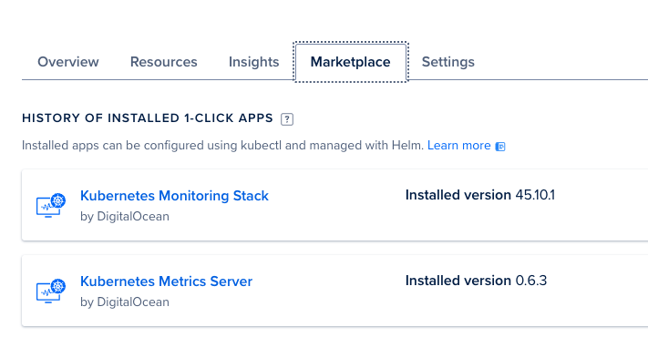
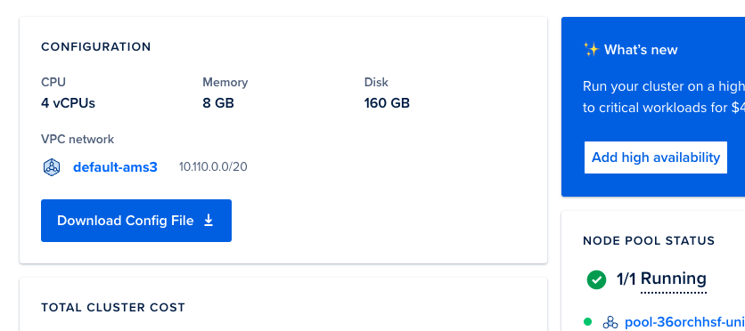
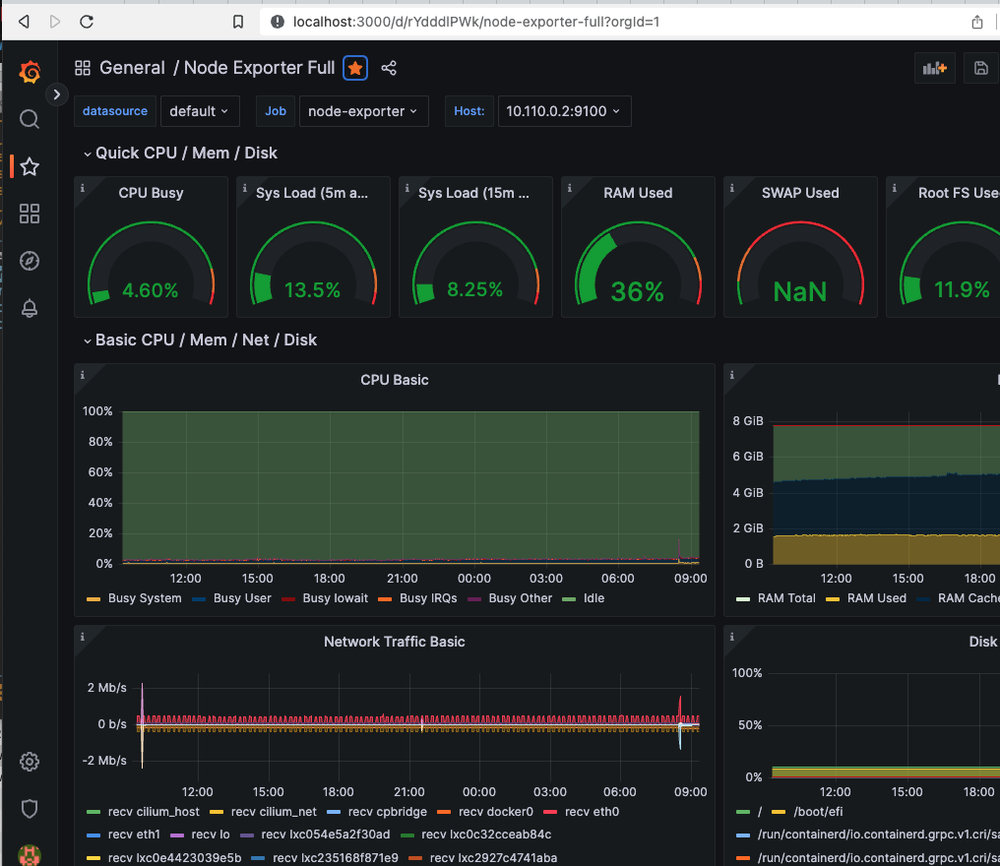

# Grafana how-to

Grafana and related packages can be installed using a Helm chart or kubernetes manifest file.

In this case will be installed using the Marketplace from Digital Ocean into our DOK cluster.



There are several instructions available. Please read the complete documentation at https://marketplace.digitalocean.com/apps/kubernetes-monitoring-stack

The way to get the username and password is by reviewing Grafana's secrets.

```bash
❯ kubectl -n kube-prometheus-stack get secrets kube-prometheus-stack-grafana -o jsonpath='{.data.admin-user}'  | base64 --decode && echo "\n";
admin

❯ kubectl -n kube-prometheus-stack get secrets kube-prometheus-stack-grafana -o jsonpath='{.data.admin-password}'  | base64 --decode && echo "\n";
prom-operator

```

Take note of both values to access the Grafana interface with the port-forward

```bash
❯ kubectl port-forward svc/kube-prometheus-stack-grafana 3000:80 -n kube-prometheus-stack
```

Access with your browser to http://localhost:3000


You can now enter Grafana and review the dashboards.


Our current DOK cluster



Main Grafana user interface


